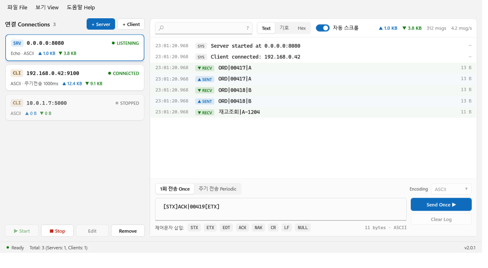
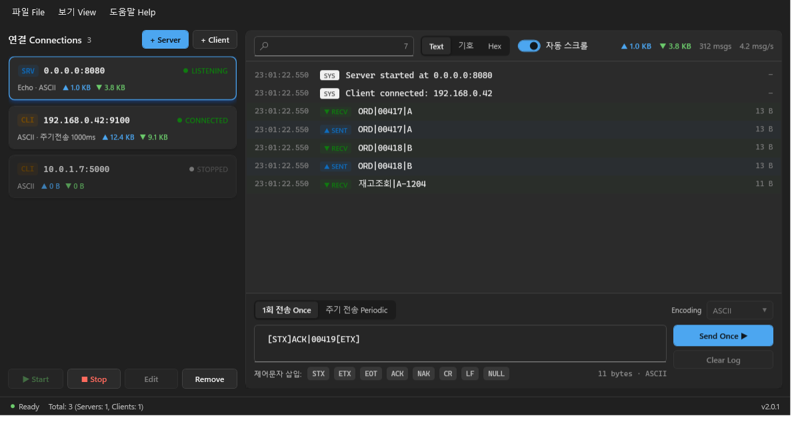

# SYN/ACK — Socket Test Tool

**TCP 서버와 클라이언트를 원하는 만큼 만들어 한 화면에서 동시에 굴려 보는 통신 테스트 도구입니다.**

장비나 서버와 연동하기 전에, 상대가 없어도 먼저 확인해 볼 수 있습니다.
"이 포트로 이런 전문을 보내면 저쪽이 뭐라고 답하는가"를 코드 한 줄 짜지 않고 눈으로 봅니다.



---

## 이런 일을 할 수 있습니다

- **상대 장비 흉내내기** — 아직 장비가 없을 때, 정해진 응답을 돌려주는 가짜 서버를 띄웁니다.
- **내 서버가 제대로 답하는지 확인** — 클라이언트로 붙어서 전문을 던져 보고 응답을 봅니다.
- **전문이 실제로 어떤 바이트로 나가는지 확인** — `[STX]`, `[ETX]` 같은 제어문자가 제대로 실려 나가는지 16진수로 봅니다.
- **한글이 깨지는지 확인** — 연결마다 ASCII / UTF-8 / EUC-KR을 따로 지정합니다.
- **주기적으로 하트비트 보내기** — 정해진 간격으로 같은 전문을 반복 전송합니다.
- **오가는 데이터를 다른 서버로 중계** — 받은 내용을 그대로 다른 수집 서버로 흘려보냅니다.
- **통신 내용을 파일로 남기기** — 연결마다 실시간으로 로그 파일에 기록합니다.

---

## 설치와 실행

### 준비물

- Windows 10 이상 (64비트)
- [.NET 8 SDK](https://dotnet.microsoft.com/download/dotnet/8.0) (직접 빌드할 때만 필요)

### 설치 파일로 설치하기 (가장 간단)

[**Releases**](https://github.com/jjscan/synack-socket-test-tool/releases/latest) 에서 `SYNACK_Setup_v2.0.5.exe` 를 받아 실행하면 됩니다.

**.NET을 따로 설치할 필요가 없습니다.** 런타임이 실행 파일 안에 들어 있어서, .NET이 없는 PC에서도 그대로 돕니다.

설치 프로그램은 관리자 권한을 요청하며, 기본 설치 위치는 `C:\Program Files\SYNACK Socket Test Tool` 입니다. 제거는 Windows의 "앱 및 기능"에서 하면 되고, 프로그램이 만든 `Logs\`·`theme.json`·`recent-sessions.json` 까지 같이 지워집니다.

### 빌드해서 실행하기

```bash
dotnet build
```

빌드된 실행 파일은 여기 있습니다.

```
bin\Debug\net8.0-windows\win-x64\SocketTestTool.exe
```

> **주의** — 실행 파일은 `win-x64` 폴더 **안**에 있습니다. 그 위 폴더에도 같은 이름의 오래된 파일이 있을 수 있는데, 그걸 실행하면 최신 변경사항이 반영되지 않습니다.

### 배포용으로 만들기

```bash
dotnet publish -p:PublishProfile=FolderProfile
```

.NET이 설치되지 않은 PC에서도 도는 단일 실행 파일이 `bin\Release\net8.0-windows\publish\win-x64\` 에 만들어집니다.

### 설치 파일 다시 만들기

[Inno Setup 6](https://jrsoftware.org/isdl.php) 이 필요합니다. **위의 `dotnet publish` 를 먼저 해야 합니다.**

```bash
"C:\Program Files (x86)\Inno Setup 6\ISCC.exe" installer\SocketTestTool.iss
```

스크립트는 [`installer/SocketTestTool.iss`](installer/SocketTestTool.iss) 이고, 결과물은 `installer\dist\` 에 생깁니다. 버전이 배포본과 어긋나면 컴파일 단계에서 멈추므로, publish를 건너뛴 채 설치 파일만 다시 만드는 실수는 나지 않습니다.

**설치 파일 자체를 시험 삼아 설치해 볼 때는 `/DTEST` 를 붙여 만드세요.**

```bash
"C:\Program Files (x86)\Inno Setup 6\ISCC.exe" /DTEST installer\SocketTestTool.iss
```

AppId와 설치 경로가 달라져 실제 설치본과 분리됩니다. 이걸 빠뜨리면 시험 설치를 제거할 때 **이 PC에 깔려 있는 진짜 설치본의 "앱 및 기능" 항목과 시작 메뉴 바로가기까지 함께 지워집니다.**

> `installer\dist\` 는 저장소에 커밋하지 않습니다(`.gitignore`). 만들어진 설치 파일은 **Releases에 올립니다.** 48 MB짜리 바이너리를 버전마다 커밋하면 클론 용량이 계속 누적되기 때문입니다.

### 관리자 권한이 필요합니다

이 프로그램은 **관리자 권한으로 실행**됩니다. 1024번 미만의 포트를 열거나 다른 프로세스의 포트 점유를 확인하는 데 필요합니다. 실행하면 Windows가 권한을 물어봅니다.

---

## 5분 만에 시작하기

내 PC 안에서 서버와 클라이언트를 하나씩 만들어 서로 통신시켜 보겠습니다.

### 1. 서버 만들기

1. **`+ Server`** 를 누릅니다.
2. IP는 `0.0.0.0`(기본값) 그대로 둡니다. → 이 PC의 모든 네트워크로 접속을 받겠다는 뜻입니다.
3. Port에 `8080`을 넣습니다.
4. 응답 패턴은 **`수신 데이터 그대로 응답 (Echo)`** 를 고릅니다.
5. **`추가 Add`** 를 누릅니다.

목록에 카드가 하나 생깁니다. 카드를 고르고 **`▶ Start`** 를 누르면 상태가 **LISTENING**으로 바뀝니다.

### 2. 클라이언트 만들기

1. **`+ Client`** 를 누릅니다.
2. IP `127.0.0.1`, Port `8080`을 넣습니다. → 방금 만든 서버입니다.
3. **`추가 Add`** → 카드를 고르고 **`▶ Start`**.

상태가 **CONNECTED**로 바뀌고, 서버 로그에 `Client connected`가 찍힙니다.

### 3. 전송 하기

1. 클라이언트 카드를 고릅니다.
2. 아래 입력창에 `HELLO`를 칩니다.
3. **`Send Once ▶`** 를 누릅니다.

서버 로그에 `▼ RECV HELLO`가 뜨고, Echo 서버라 그대로 되돌려 보내므로 클라이언트 로그에도 `▼ RECV HELLO`가 뜹니다. 왕복 성공입니다.

---

## 화면 구성

| 위치 | 내용 |
| --- | --- |
| **왼쪽** | 만들어 둔 연결 목록. `SRV`/`CLI` 배지, 주소, 상태(LISTENING·CONNECTED·STOPPED·ERROR), 주고받은 양 |
| **오른쪽 위** | 검색창, `Text`/`기호`/`Hex` 보기 전환, 자동 스크롤, 통계 |
| **오른쪽 가운데** | 통신 로그. 시각 · 방향 · 내용 · 길이 |
| **오른쪽 아래** | 보낼 내용을 쓰는 곳. `1회 전송` / `주기 전송` 탭 |
| **맨 아래** | 전체 연결 수, 활성 서버·클라이언트 수, 버전 |

연결을 여러 개 고르면(Ctrl·Shift) **한꺼번에 시작·중지·삭제**할 수 있습니다.

---

## 기능별 사용법

### 서버 응답 패턴 — 상대 장비 흉내내기

연결 추가 창에서 네 가지 중 고릅니다.

| 패턴 | 동작 | 언제 쓰나 |
| --- | --- | --- |
| **Echo** | 받은 그대로 돌려보냄 | 연결이 되는지만 빠르게 확인할 때 |
| **Send Once on Connect** | 접속하자마자 정해진 전문을 1회 전송 | 접속 인사를 보내는 장비 흉내 |
| **Reply After Receive** | 받으면 정해진 전문으로 응답 (1회 또는 계속) | ACK를 돌려주는 장비 흉내 |
| **Listen Only** | 받기만 하고 자동 응답 안 함 | 들어오는 내용만 관찰할 때 |

### 규칙 기반 응답 — 내용에 따라 다르게 답하기

"이 문자열이 들어오면 저 문자열로 답한다"를 표로 등록합니다.

| 받으면 | 보낸다 |
| --- | --- |
| `PING` | `PONG` |
| `ORD\|` | `[STX]ACK[ETX]` |

규칙이 **응답 패턴보다 우선**합니다. 규칙에 걸리지 않은 내용만 위의 패턴대로 처리됩니다.

### 제어문자 보내기

입력창 아래 **`STX` `ETX` `EOT` `ACK` `NAK` `CR` `LF` `NULL`** 칩을 누르면 태그가 삽입됩니다.

```
[STX]ACK|00419[ETX]
```

이렇게 쓰면 실제로는 `02 41 43 4B 7C 30 30 34 31 39 03` 바이트가 나갑니다.
입력창 오른쪽에 **실제 전송될 바이트 수**가 표시되니 전문 길이를 맞출 때 보세요.

### 주기적으로 보내기

`주기 전송 Periodic` 탭 → 보낼 내용과 간격(ms)을 넣고 **`Start / Stop`**.

> 간격을 10ms처럼 아주 짧게 줘도 Windows 특성상 실제로는 약 15.6ms가 하한입니다.

### 인코딩

화면 오른쪽 아래 `Encoding`에서 연결마다 따로 고릅니다. 기본값은 **ASCII**입니다.
한글을 주고받는다면 상대에 맞춰 **EUC-KR** 또는 **UTF-8**로 바꾸세요.

> 연결이 **실행 중일 때는 바꿀 수 없습니다.** 중지하고 바꾼 뒤 다시 시작하세요.

### 수신 데이터 자동 전달 — 받은 걸 다른 서버로 중계

연결 추가 창의 **`수신 데이터 자동 전달`** 을 켜고 대상 IP/Port를 넣으면, 받은 **원본 바이트를 그대로** 그 서버로 보냅니다.

대상 서버가 꺼져 있어도 괜찮습니다. 최대 1,000건까지 보관해 두었다가 **다시 켜지면 순서대로 재전송**합니다.

### 로그 보기 · 검색 · 저장

- **`Text`** — 글자 그대로
- **`기호`** — 눈에 안 보이는 제어문자를 `[STX]` 같은 태그로 표시
- **`Hex`** — 16진수 덤프를 함께 표시
- 검색창에 치면 걸러집니다. 오른쪽에 `일치/전체` 개수가 나옵니다. **16진수로도 검색됩니다.**
- 화면 로그는 최근 **1,000건**만 유지됩니다. 전부 남기려면 아래 파일 로깅을 쓰세요.

**파일로 남기기** — 연결 추가 창에서 `로그 자동저장`을 켜면 통신 내용이 실시간으로 파일에 쌓입니다. 경로를 지정하지 않으면 실행 파일 옆 `Logs` 폴더에 만들어집니다.
지금 보이는 로그만 저장하려면 **파일 → Save Log**.

### 세션 저장 · 불러오기

**파일 → Save Session** 으로 지금 만들어 둔 연결 설정 전체를 `.json` 파일로 저장합니다.
다음에 **Load Session** 으로 그대로 복원됩니다. 자주 쓰는 테스트 구성을 저장해 두세요.

연결이 하나도 없을 때는 시작 화면에서 **최근에 열었던 세션**을 바로 고를 수 있습니다.

### 테마

**보기 View → 테마 Theme** 에서 **시스템 설정 따르기 / 라이트 / 다크** 중 고릅니다. 다시 시작할 필요 없이 즉시 바뀌고, 다음 실행에도 유지됩니다.



---

## 자주 겪는 문제

**"포트를 열 수 없습니다"가 뜹니다**
다른 프로그램이 그 포트를 쓰고 있습니다. 배너의 **`누가 쓰는지 보기`** 를 누르면 점유 중인 프로그램 이름과 PID를 알려 줍니다. 그 프로그램을 끄거나 **`포트 변경`** 으로 다른 포트를 쓰세요.

**클라이언트가 접속이 안 됩니다**
연결 추가 창의 **`Check`** 버튼을 눌러 보세요. 상대까지 닿는지(ICMP), 포트가 열려 있는지 각각 알려 줍니다. 방화벽에 막힌 경우도 구분해서 표시합니다.

**다른 PC에서 내 서버로 접속이 안 됩니다**
서버 IP가 `127.0.0.1`로 되어 있지 않은지 보세요. `127.0.0.1`은 **이 PC 안에서만** 접속할 수 있습니다. `0.0.0.0`으로 바꾸면 모든 네트워크에서 받습니다. Windows 방화벽 허용도 확인하세요.

**한글이 깨져 보입니다**
`Encoding`이 상대와 다릅니다. 국내 장비는 대개 **EUC-KR**입니다.

**긴 전문이 중간에 잘려 보입니다**
화면과 로그 파일에는 앞 **4KB**까지만 표시합니다(`… (총 N 바이트 중 4,096 바이트만 표시)`). 통신 자체는 전량 정상 처리되며 잘리는 것은 **표시뿐**입니다. 큰 전문 하나가 화면을 멈추게 하는 것을 막기 위한 제한입니다.

**전문이 두 건으로 쪼개져 들어옵니다**
TCP는 전문 단위를 보장하지 않습니다. 연결 추가 창의 **`수신 대기 Receive timeout`**(기본 300ms)을 늘려 보세요. 그 시간 동안 추가 데이터가 없으면 한 건으로 합쳐서 처리합니다.

---

## 알아 둘 제약

- 화면 로그는 연결당 최근 1,000건만 유지 (파일 로깅은 전량 기록)
- 자동 전달 보관 큐는 1,000건 상한, 넘으면 오래된 것부터 폐기
- 주기 전송의 실질 하한 간격은 약 15.6ms (Windows 타이머 특성)
- 창 제목 표시줄은 Windows 10에서 다크로 바뀌지 않습니다 (OS 제약)

---

## 개발자용 문서

| 문서 | 내용 |
| --- | --- |
| [AGENTS.md](AGENTS.md) | 코드를 고치기 전에 읽을 것 — 구조, 규칙, 함정 |
| [QA-HISTORY.md](QA-HISTORY.md) | 검증 이력, 고쳐 온 결함과 그 이유, **고치면 안 되는 의도된 동작** |
| [VERSIONING.md](VERSIONING.md) | 버전 올리는 기준 |
| [qa/README.md](qa/README.md) | 검증 하네스 실행 방법 (기능 176개 / 부하 60개) |

앱 안에서는 **도움말 Help → Version History** 로 버전별 변경 내역을 볼 수 있습니다.

---

## 라이선스

MIT License. 자세한 내용은 [Assets/LICENSE_MIT_en_ko.rtf](Assets/LICENSE_MIT_en_ko.rtf) (영문·국문)를 보세요.
